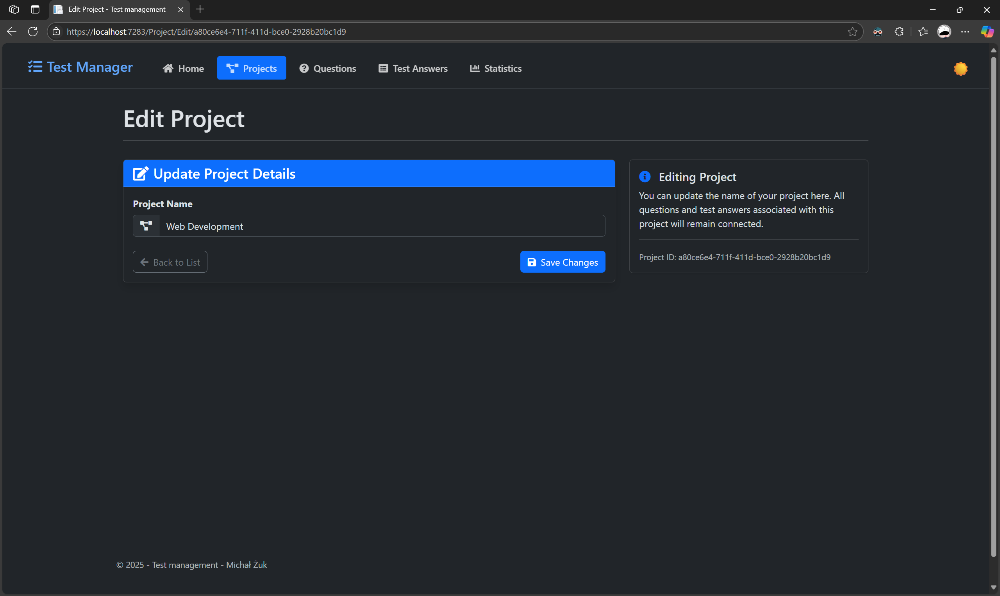

# Test Management System

A web application for creating and managing tests with multiple choice, single choice, and open-ended questions.

## Features

### Core Functionality
- **Project Management**: Create, edit, delete, and view test projects
- **Question Management**: Handle multiple question types with full CRUD operations
- **Answer Management**: Manage test answers with comprehensive controls
- **Statistics Dashboard**: View performance metrics for individual or all tests
- **Search & Sort**: Advanced filtering and pagination for test answers

### Key Capabilities
- Multi-choice and open-ended question support
- Quick navigation between related entities
- Statistical analysis and reporting
- Responsive web interface
- Data persistence and management

## Technical Implementation

### Architecture
- **Three-tier architecture** with associated entities:
  - Projects → Questions (one-to-many)
  - Questions → Test Answers (one-to-many)
  - Test Answers → Questions (many-to-one)

### Database Design
- Full CRUD operations for all entities
- Navigational properties linking related models
- Optimized queries with pagination support

### Advanced Features
- **Search functionality**: Filter by question name or answer content
- **Multi-column sorting**: Sort by question name, correctness, or answer type
- **Pagination**: Efficient data loading and display
- **Statistics module**: Comprehensive test performance analytics

## Getting Started

1. Clone the repository
2. Install dependencies
3. Configure database connection
4. Run database migrations
5. Start the application

## Repository

[GitHub Repository](https://github.com/an4xdev/Simple-Test-Web-Maker)

## Screenshots

The application includes intuitive interfaces for:
- Project listing and management
- Question creation and editing
- Answer management with search/sort
- Statistical dashboards
- Quick navigation between entities

---

*Developed by Michał Żuk - Advanced Programming Laboratory Project*